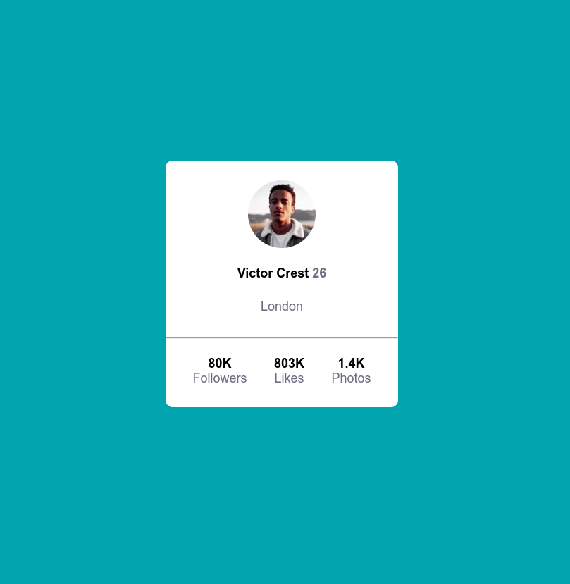

# Profile card component - Frontend Mentor

## Índice

- [Profile card component - Frontend Mentor](#profile-card-component---frontend-mentor)
  - [Índice](#índice)
  - [Sobre](#sobre)
  - [Tecnologia](#tecnologia)
- [Pré-visualização:](#pré-visualização)
    - [Links](#links)
  - [Autor](#autor)

## Sobre

Nesse projeto tive dificuldades para centralizar o card, mais com algumas dicas dos meus mentores tudo foi solucionado, e que venha o próximo.

## Tecnologia
- Foi utilizado:
    - HTML
    - CSS

# Pré-visualização:

### Links

- Solution URL: [Solution URL]()
- Live Site URL: [Live site URL]()

## Autor

- Guithub - [Wagnerpx](https://github.com/wagnerpx)
- Fronted Mentor - [@Wagnerpx](https://www.frontendmentor.io/profile/wagnerpx)
- LinkedIn - [Wagner Alexandre](https://www.linkedin.com/in/wagnerpx/)